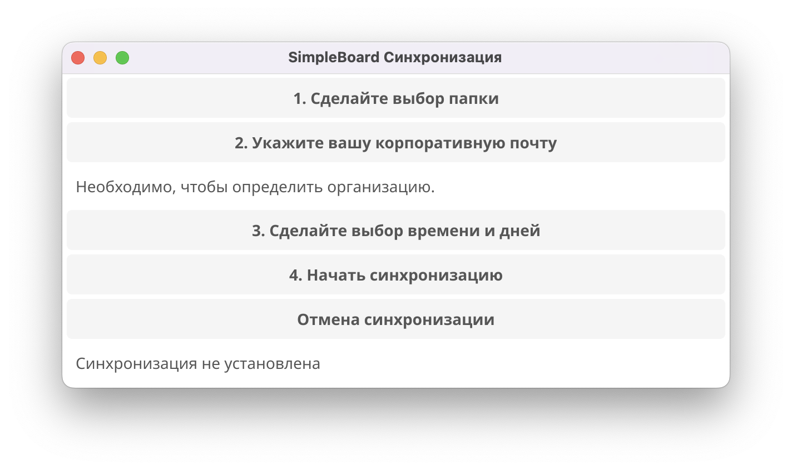

# Приложение
Позволяет пользователю настроить не-программистам передачу файлов xlsx и csv вашему проекту.

**simple_main** - это GUI чтобы настроить cron alike background tasks.

**simple_task** - это SMTP чтобы настроить передачу файлов по почте. См. email credentials.

Поддерживаются Windows & MacOS. Для Linux пользователей такой потребности нет.


## Руководство по сборке
Это руководство поможет вам создать исполняемые файлы для Windows и macOS с использованием Fyne и `fyne-cross`. Вам нужно будет настроить окружение, собрать исполняемые файлы и упаковать их.

## Предварительные требования

1. **Go (1.18+):** Убедитесь, что у вас установлен Go. Вы можете проверить установку, выполнив команду:
```bash
   go version
```
Если Go не установлен, следуйте инструкциям по установке на официальном сайте Go.

2.	Fyne и Fyne-Cross:
	•	Установите Fyne:
```bash
go install github.com/fyne-io/fyne-cross@latest
```
3.	Иконка:
Поместите файл Icon.png в корневой каталог вашего проекта.


# Сборка simple_main для Windows
1. Перейдите в каталог проекта: Убедитесь, что вы находитесь в каталоге simple_main, где расположен ваш файл main.go.

2. Выполните команду fyne-cross для сборки для Windows:
```bash
fyne-cross windows -output simple_main.exe --app-id com.simpleboard.simple_main --icon Icon.png
```
3.	Результат: После завершения сборки исполняемый файл будет доступен в следующем каталоге:
```bash
fyne-cross/bin/windows-amd64/simple_main.exe
```
4.	Распростронение: Теперь вы можете распространять файл 
```bash
simple_main.exe.
```
# Сборка simple_main для macOS
1. Перейдите в каталог проекта: Убедитесь, что вы находитесь в каталоге simple_main, где расположен ваш файл main.go.

2. Выполните команду fyne-cross для сборки для macOS:
```bash
fyne-cross darwin -output simple_main --app-id com.simpleboard.simple_main --icon Icon.png
```
3.	Результат: После завершения сборки пакет .app будет доступен в следующем каталоге:
```bash
fyne-cross/bin/darwin-arm64/simple_main.app
```
4.	Распределение: Вы можете упаковать пакет .app в zip-архив и распространять zip-файл:
```bash
fyne-cross/dist/darwin-arm64/simple_main.zip
```

# Сборка simple_sync для macOS
1. Перейдите в каталог проекта: Убедитесь, что вы находитесь в каталоге sync_task, где расположен ваш файл sync_task.go.
2. Выполните команду для сборки executable для macOS:
```bash
go build -o sync_task  
```
3. Разместите sync_task в папке, где нужна синхронизация.

 #### P.S. при возникновении проблем или потребности в доработке обращайтесь к GPT. 
